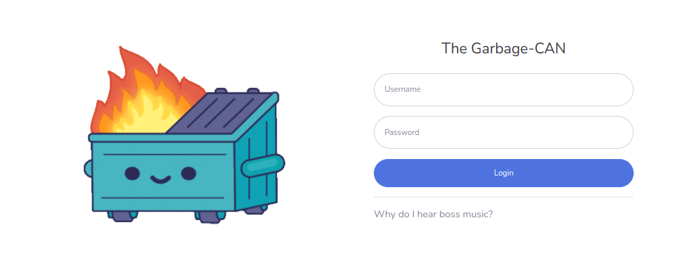

# Garbage-CAN

*A tool for CAN analysis on the Mach-E*



## Software Stack

The front-end webpage was created using free bootstrap templates and code. The bootstrap is hoted on flask, which reads database information from a sqlite3 database file.

## Install

Install python and the necessary pip libraries.

```
pip install -r requirements.txt
```

Download your sqlite3 database and put it in the main directory (same level as the readme.md)

Run `server.py` to start the app. Credentials are `admin` and `password`.

```
python3 server.py
```